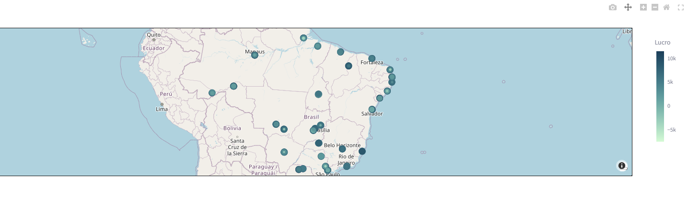
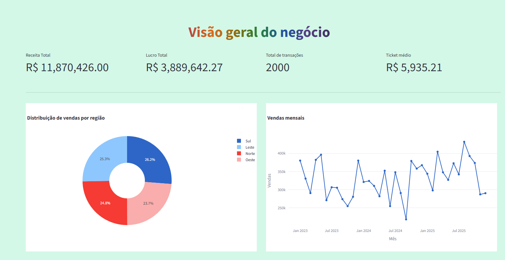

# 📊 Dashboard de Vendas - Projeto Final

<div align="center">


</div>

---

## 🎯 Sobre o Projeto

Um **dashboard interativo e responsivo** desenvolvido com Streamlit para análise completa de dados de vendas. O projeto oferece visualizações dinâmicas, análises detalhadas de produtos, geolocalização e insights em tempo real sobre o desempenho comercial.

---

## ✨ Principais Características

<table>
<tr>
<td>

📈 **Análises Avançadas**
- Visão geral de métricas
- Análise detalhada de vendas
- Performance de produtos
- Geolocalização de vendas

</td>
<td>

🗺️ **Recursos Geográficos**
- Mapa interativo com pydeck
- Localização de clientes
- Distribuição geográfica

</td>
<td>

⚡ **Performance**
- Interface responsiva
- Carregamento rápido
- Otimizado para dados grandes
- Design moderno e intuitivo

</td>
</tr>
</table>

---

## 🛠️ Tecnologias Utilizadas

<div align="center">

| Tecnologia | Versão | Uso |
|-----------|--------|-----|
| **Streamlit** | 1.28+ | Framework web interativo |
| **Python** | 3.9+ | Linguagem principal |
| **Pandas** | 2.3+ | Manipulação de dados |
| **Plotly** | 6.6+ | Visualizações interativas |
| **GeoPandas** | 1.1+ | Análise geoespacial |
| **NumPy** | 2.4+ | Computação numérica |
| **Pillow** | 12.1+ | Processamento de imagens |
| **PyDeck** | 0.9+ | Mapas interativos |

</div>

---

## 📋 Estrutura do Projeto

```
projeto_final_dashboard/
├── app.py                           # 🚀 Arquivo principal
├── gerar_dados.py                   # 📊 Geração de dados
├── gerar_localizacao.py             # 🌍 Geração de localizações
├── requirements.txt                 # 📦 Dependências
├── README.md                        # 📖 Documentação
│
├── 📁 pages/                        # Páginas do dashboard
│   ├── visao_geral.py              # 👁️ Overview geral
│   ├── analise_vendas.py           # 📈 Análise de vendas
│   ├── analise_produtos.py         # 🛍️ Análise de produtos
│   ├── analise_produto_prof.py     # 👨‍🏫 Análise para professor
│   ├── mapa.py                     # 🗺️ Mapa interativo
│   └── sobre.py                    # ℹ️ Informações
│
├── 📁 dados/                       # Base de dados
│   ├── vendas.csv                 # Dados brutos
│   ├── vendas_geo.csv             # Vendas com geolocalização
│   ├── vendas_geo_resumo.csv      # Resumo geográfico
│   └── vendas_geolocalizacao.csv  # Detalhes de localização
│
└── 📁 img/                        # Imagens do projeto
    ├── image1.png
    └── image2.png
```

---

## 🚀 Como Instalar e Executar

### 1️⃣ Pré-requisitos
- Python 3.9 ou superior
- pip (gerenciador de pacotes Python)

### 2️⃣ Instalação

```bash
# Clone o repositório
git clone <seu-repositorio>
cd projeto_final_dashboard

# Crie um ambiente virtual (recomendado)
python -m venv venv

# Ative o ambiente virtual
# No Windows:
venv\Scripts\activate

# No macOS/Linux:
source venv/bin/activate

# Instale as dependências
pip install -r requirements.txt
```

### 3️⃣ Executar o Dashboard

```bash
streamlit run app.py
```

O dashboard abrirá em `http://localhost:8501`

---

## 📱 Páginas do Dashboard

| Página | Ícone | Descrição |
|--------|-------|-----------|
| **Visão Geral** | 👁️ | Métricas e indicadores principais (KPIs) |
| **Análise de Vendas** | 📈 | Gráficos e análises detalhadas de vendas |
| **Análise de Produtos** | 🛍️ | Performance e distribuição de produtos |
| **Análise Avançada** | 👨‍🏫 | Análises profundas de produtos |
| **Mapa** | 🗺️ | Visualização geográfica das vendas |
| **Sobre** | ℹ️ | Informações do projeto |

---

## 📸 Galeria de Screenshots

<div align="center">

### Dashboard - Visão Geral


### Análise de Dados


</div>

---

## 💾 Gerenciamento de Dados

O projeto inclui scripts para geração e processamento de dados:

- **`gerar_dados.py`** - Gera dados de vendas em formato CSV
- **`gerar_localizacao.py`** - Processa dados geográficos e cria arquivos de localização
- **`dados/`** - Pasta contendo todos os arquivos CSV com dados processados

---

## ⚙️ Configurações Personalizáveis

O projeto possui algumas configurações no `app.py`:

```python
st.set_page_config(
    page_title="Dashboard de vendas",
    page_icon="📎",
    layout="wide"
)
```

Você pode customizar:
- 🎨 **Cores**: Modifique o `background-color` no CSS
- 📄 **Título**: Altere `page_title`
- 📍 **Ícone**: Mude `page_icon`
- 📐 **Layout**: Ajuste `layout` para "centered" ou "wide"

---

## 🎓 Aprendizados e Tecnologias

Este projeto demonstra:

✅ Desenvolvimento de aplicações web com Streamlit  
✅ Manipulação e análise de dados com Pandas  
✅ Visualizações interativas com Plotly  
✅ Processamento de dados geoespaciais com GeoPandas  
✅ Criação de interfaces responsivas e intuitivas  
✅ Integração de múltiplas páginas em um dashboard  

---

## 📧 Contato e Suporte

Para dúvidas, sugestões ou reportar bugs, abra uma **issue** no repositório.

---

<div align="center">

**⭐ Se este projeto foi útil, considere dar uma estrela no repositório!**

Desenvolvido com ❤️ usando Python e Streamlit

</div>
